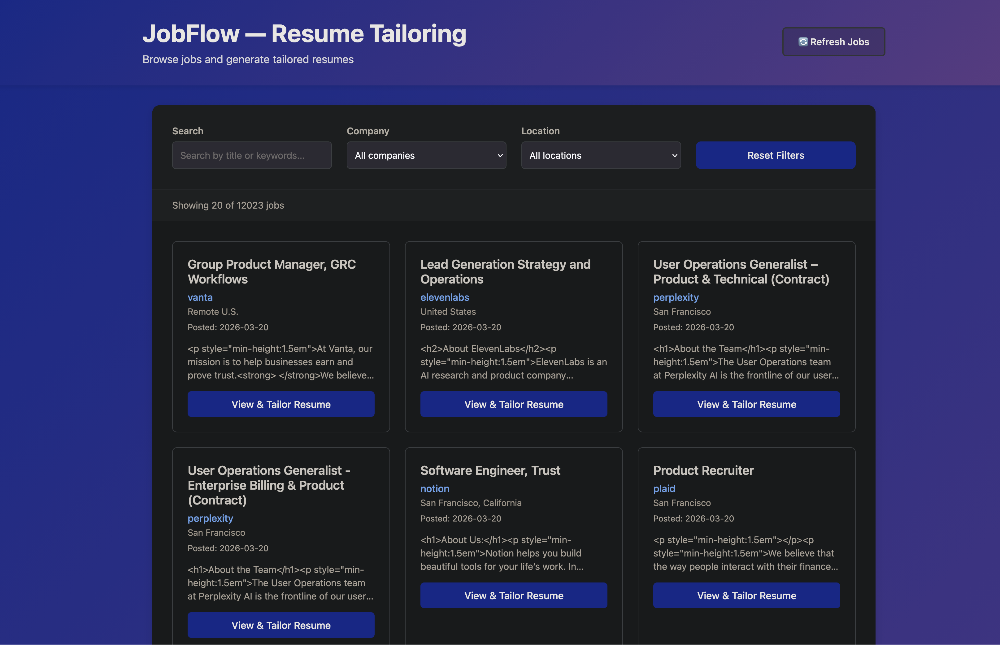

This is a comprehensive, professional-grade README designed to present **JobFlow** as a sophisticated engineering project. It uses a clean, technical tone that highlights your architectural decisions and the specific hardware optimizations for your MacBook Pro.

---

# JobFlow (MVP)

JobFlow is a self-hosted job discovery and resume tailoring engine designed to centralize and automate the high-volume nature of modern job applications. It functions by scraping niche Applicant Tracking Systems (ATS), indexing thousands of listings into a local SQLite database, and utilizing local Large Language Models (LLMs) to generate bespoke resumes.

The project is built specifically for the Apple Silicon ecosystem, prioritizing data privacy and performance by running all AI inference locally via Ollama.

---

## Intended Use

JobFlow is designed for developers and power users who want a centralized, private interface for their job search. Instead of manually checking dozens of individual company career pages, the user runs the ingestion engine to pull new listings into a local database. 

Once indexed, the user can browse listings through the React frontend, select a role, and trigger the LLM to rewrite their resume bullet points to align with the specific job description. The final output is a professional, high-fidelity PDF ready for submission.

---

## System Architecture

The project is architected with a strict separation of concerns, divided into three core layers:

### 1. High-Concurrency Ingestion
To handle the scale of 10,000+ jobs across 150+ companies, JobFlow uses a multithreaded architecture. 
* **Worker Pools:** Utilizing Python’s `ThreadPoolExecutor`, the system executes parallel API calls to Greenhouse, Ashby, and Lever. This ensures the scraping process is bound by network I/O rather than being slowed down by sequential execution.
* **Universal Fetch Engine:** All ATS workers pass raw API responses through a specialized field mapping layer and a thread-local SQLite connection to ensure thread-safe database writes.

### 2. The Workday Dual-Path Strategy
Workday implementations vary significantly in their bot-detection capabilities. JobFlow handles this with a specialized dual-logic:
* **Plain Path:** Direct `requests.Session` for unprotected tenants (e.g., Intel, BMO).
* **Headless Path:** Employs Playwright-driven Chromium with custom stealth scripts. These scripts mask `navigator.webdriver`, spoof browser plugins, and inject `window.chrome` objects to bypass advanced enterprise-grade bot protection.

### 3. Backend & Persistence
* **FastAPI:** Provides a RESTful interface for the frontend to query the job index.
* **SQLAlchemy 2.0:** Manages the relational mapping between job listings and user interaction data.
* **SQLite:** Chosen for zero-configuration local portability. The schema utilizes `ON CONFLICT` logic to ensure listings are updated rather than duplicated.

---

## Processing Pipeline

JobFlow operates through a multi-stage pipeline that transforms raw job postings into tailored, publication-ready resumes:

```
┌─────────────┐     ┌──────────────┐     ┌──────────────┐     ┌─────────────┐
│   INGEST    │────▶│ TRANSFORM    │────▶│  COMPILE    │────▶│   OUTPUT    │
│             │     │              │     │              │     │             │
│ Scrape ATS  │     │ Parse Resume │     │ Generate PDF │     │ LaTeX/.tex  │
│ Thread Pool │     │ Tailor with  │     │ via pdflatex │     │ + .pdf      │
│ + DB writes │     │ LLM (Ollama) │     │              │     │             │
└─────────────┘     └──────────────┘     └──────────────┘     └─────────────┘
      │                    │                     │                   │
      ▼                    ▼                     ▼                   ▼
   SQLite DB          JSON Schema           LaTeX Template      Resume PDF
  (12,000+ jobs)      (Structured)          (Jinja2 Render)      (Ready to Submit)
```

---

## Project Structure

```
JobFlow/
├── backend.py                 # FastAPI server (port 8000) serving job index
├── ingest.py                  # Multi-threaded scraper orchestrator
├── main.py                    # CLI for parsing and tailoring resumes
├── readme.md                  # Project documentation
├── requirements.txt           # Python dependencies
│
├── config/
│   └── default.yaml          # LLM config (model, tailoring rules, output limits)
│
├── data/
│   ├── input.txt             # Sample raw resume text
│   └── test_job.txt          # Sample job posting for testing
│
├── resume/                    # Resume tailoring module
│   ├── __init__.py
│   ├── llm.py                # Ollama integration (call_llm, build_prompt)
│   └── templates/
│       └── resume.tex.j2     # Jinja2 LaTeX template for PDF generation
│
├── frontend/                  # React + Vite web interface
│   ├── src/
│   │   ├── App.jsx           # Main React application
│   │   ├── api.js            # Fetch wrapper for backend endpoints
│   │   ├── main.jsx          # Entry point
│   │   ├── components/       # React components
│   │   │   ├── JobList.jsx   # Job listings table/cards
│   │   │   ├── JobDetail.jsx # Detail view + tailor button
│   │   │   └── ErrorBoundary.jsx # Error handling wrapper
│   │   └── styles/           # CSS modules
│   │       ├── app.css
│   │       ├── job-list.css
│   │       └── job-detail.css
│   ├── index.html
│   ├── vite.config.js
│   └── package.json
│
├── output/                    # Generated resumes (gitignored)
│   ├── company_role_resume.tex
│   └── company_role_resume.pdf
│
└── .venv/                     # Python virtual environment
```

---

## Workflow Layers

The pipeline has distinct responsibility layers:

| Layer | Tool/Technology | Input | Output | Key Logic |
| :--- | :--- | :--- | :--- | :--- |
| **Ingest** | Python + Requests/Playwright | ATS API/Web | SQLite (jobflow.db) | ThreadPoolExecutor, field mapping, conflict resolution |
| **Transform** | Ollama (mistral:7b-instruct) | Resume text + Job posting + Config | JSON schema (structured) | LLM prompt engineering, bullet validation, skill matching |
| **Compile** | Jinja2 + pdflatex | JSON data + LaTeX template | Resume.pdf | Template rendering, PDF generation |
| **Serve** | FastAPI + React | SQLite + User actions | Web UI + API responses | Job browsing, filtering, triggering tailoring |

---

## AI Integration

JobFlow avoids the latency and privacy risks of cloud-based APIs by leveraging local inference on Apple Silicon.

* **Hardware Optimization:** The system was developed and tested on a 2023 MacBook Pro. It is optimized for M-series unified memory (24GB+), utilizing Metal acceleration via Ollama for near-instantaneous text generation.
* **Model Benchmarking:** During development, several models were benchmarked for reasoning and JSON adherence, including `llama3.2:1b` and `phi4:latest`. 
* **Primary Engine:** `mistral:7b-instruct` was selected for the final MVP due to its superior ability to accurately rewrite professional experience while following strict configuration constraints defined in a YAML control file.
* **Tailoring Logic:** The LLM does not just "summarize"; it parses a raw text resume into a structured JSON schema, matches skills against a job description, and outputs rewritten bullet points that highlight relevant achievements.

---

## Technical Stack

| Layer | Technologies |
| :--- | :--- |
| **Local AI** | Ollama (mistral:7b-instruct), Jinja2, YAML Configs |
| **Frontend** | React 18, Vite, CSS Modules, Native Fetch |
| **Backend** | FastAPI, SQLAlchemy 2.0, Pydantic v2, Uvicorn |
| **Scraping** | Playwright (Headless), Requests, ThreadPoolExecutor |
| **Database** | SQLite |
| **PDF Rendering** | pdflatex (Jinja2) & ReportLab |

---

## Build Phases & Roadmap

JobFlow is currently an MVP in Phase 3 of development.

* **Phase 1: Multi-ATS Scraper Engine** (Complete) — Greenhouse, Ashby, Lever, and Workday workers are live.
* **Phase 2: Persistence & Normalization** (Complete) — SQLite schema and SQLAlchemy models finalized.
* **Phase 3: Full Stack MVP** (Complete) — FastAPI endpoints and React interface for job browsing are functional.
* **Phase 4: Resume Precision** (In Progress) — Refining LLM prompt engineering to achieve higher-fidelity tailoring.
* **Phase 5: Ranking Algorithms** (Planned) — Exploring weighted scoring based on keyword density and user signals.
* **Phase 6: Binary-Free PDF Generation** (Planned) — Finalizing the transition from LaTeX to pure Python ReportLab for easier distribution.

---

## In-Progress: ATS API Repository

Beyond this project, I'm actively maintaining a living repository of job scraping APIs and their status. **Many ATS platforms change their API structures frequently**, breaking existing scrapers. This parallel effort tracks:

- **Current & Working APIs** — Greenhouse, Ashby, Lever, and Workday endpoints with active support
- **Deprecated/Broken APIs** — Historical APIs and endpoints that no longer work
- **Maintenance Strategy** — Regular audits and contributor-driven fixes
- **Integration Guide** — How to plug new/updated APIs into JobFlow

This repository serves as both a knowledge base and a scalable way to handle the constant evolution of job board infrastructure.

---

## User Interface

The JobFlow frontend provides an intuitive interface for job discovery and resume tailoring:



**Features shown:**
- **Full-text search** across job titles and keywords
- **Company filtering** to focus on specific organizations
- **Location filtering** for geographical preferences
- **Live job count** showing database size
- **Job cards** with company, location, date posted, and description snippet
- **"View & Tailor Resume"** button to generate tailored versions for each posting

---

## Limitations

* **Model Sensitivity:** The quality of the tailored resume is highly dependent on the quality of the input text and the specific LLM model used.
* **Scraper Maintenance:** ATS platforms frequently update their frontend structures, which may require periodic updates to the Playwright interceptors.
* **Local Resources:** Running the full stack (FastAPI, React, and an LLM) requires a modern machine with at least 16GB of RAM for a smooth experience.

---

## Getting Started

1. **Prerequisites:** Ensure you have Ollama installed and running. Download the Mistral model: `ollama pull mistral`.
2. **Environment:** Create a virtual environment and install dependencies: `pip install -r requirements.txt`.
3. **Browsers:** Install Playwright Chromium binaries: `playwright install chromium`.
4. **Run:** Execute `python scraper.py` to populate the database, then launch the backend and frontend separately.

---

*Note: In the development of this project, Claude and GitHub Copilot were utilized to assist in code generation and architectural optimization.*
